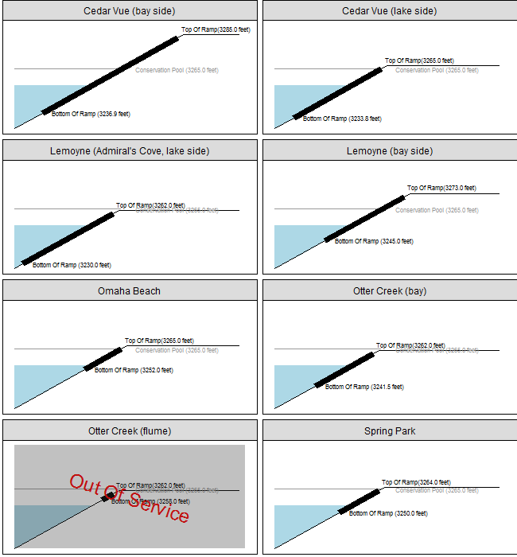
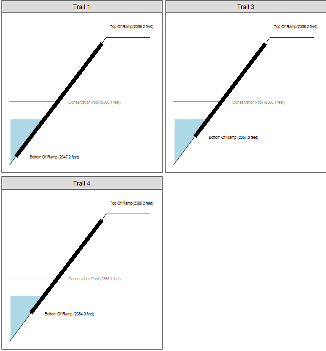

---
title: Boat Ramp Conditions For Selected Nebr. Reservoirs
date: 'January 17, 2018 '
header-includes:
- \usepackage{fancyhdr}
- \pagestyle{fancy}
- \fancyhead{}
- \fancyhead[LE,RO]{\thepage}
- \fancyfoot[CO,CE]{Report generated on 2018-01-17 10:24:46}
geometry: margin=1.0in
---

The information presented in the following pages represents the information available at the time the report was generated and has been aggregated from external sources.  No guarantees are provided on the accuracy of the information in this report and no assurances are provided on the status or availability of any individual boat launch facility.  Pleace contact the appropiate facility managers to determine usability of any access facilities.  

In addition, any given boat ramp will be out-of-service when water levels are anywhere from 2-4 feet ABOVE the end of the ramp depending on vehicle/trailer configurations.

\tableofcontents

\newpage

#Sources

Information for this report was gathered from: Bureau Of Reclamation, Central Public Power District, Army Corp Of Engineers, Farwell Irrigation District, and the Nebraska Game and Parks Commission.

Specific sources of current water elevations were:

|Reservoir      |Source                                                          |
|:--------------|:---------------------------------------------------------------|
|Box Butte      |https://www.usbr.gov/gp-bin/arcweb_bbne.pl                      |
|Calamus        |https://www.usbr.gov/gp-bin/arcweb_cane.pl                      |
|Davis Creek    |https://www.usbr.gov/gp-bin/arcweb_dane.pl                      |
|Elwood         |http://cnppid.com/wp-content/uploads/2016/06/lakeRiverData.html |
|Enders         |https://www.usbr.gov/gp-bin/arcweb_edne.pl                      |
|Harlan         |https://www.usbr.gov/gp-bin/arcweb_hcne.pl                      |
|Jeffrey        |http://cnppid.com/wp-content/uploads/2016/06/lakeRiverData.html |
|Johnson        |http://cnppid.com/wp-content/uploads/2016/06/lakeRiverData.html |
|McConaughy     |http://cnppid.com/wp-content/uploads/2016/06/lakeRiverData.html |
|McConaughy2    |http://cnppid.com/wp-content/uploads/2016/06/lakeRiverData.html |
|Medicine Creek |https://www.usbr.gov/gp-bin/arcweb_hsne.pl                      |
|Merritt        |https://www.usbr.gov/gp-bin/arcweb_mrne.pl                      |
|Minatare       |https://www.usbr.gov/gp-bin/arcweb_lmne.pl                      |
|Red Willow     |https://www.usbr.gov/gp-bin/arcweb_hbne.pl                      |
|Sherman        |http://farwellid.org/sherman%20reservoir.html                   |
|Swanson        |https://www.usbr.gov/gp-bin/arcweb_trne.pl                      |
|Winters Creek  |https://www.usbr.gov/gp-bin/arcweb_wcne.pl                      |

#Current Water Levels

|Reservoir      | Elevation| Conservation Pool Elevation| Feet Below Conservation Pool|
|:--------------|---------:|---------------------------:|----------------------------:|
|Box Butte      |      3985|                        4007|                           22|
|Calamus        |      2240|                        2244|                            4|
|Davis Creek    |      2054|                        2076|                           22|
|Elwood         |      2600|                        2608|                            8|
|Enders         |      3082|                        3112|                           30|
|Harlan         |      1938|                        1946|                            7|
|Jeffrey        |      2757|                        2758|                            1|
|Johnson        |      2614|                        2618|                            4|
|McConaughy     |      3254|                        3265|                           10|
|Medicine Creek |      2360|                        2366|                            6|
|Merritt        |      2944|                        2946|                            2|
|Minatare       |      4108|                        4125|                           17|
|Red Willow     |      2566|                        2588|                           22|
|Sherman        |      2155|                        2162|                            7|
|Swanson        |      2738|                        2752|                           14|
|Winters Creek  |      4122|                        4129|                            7|

\newpage

  
# Box Butte   
  
\includegraphics[height=3.5in]{pics/butte.png}  
  

\newpage  
  
# Calamus   
  
\includegraphics[height=3.5in]{pics/calamus.png}  
  

\newpage  
  
# Davis Creek   
  
\includegraphics[height=3.5in]{pics/davis.png}  
  

\newpage  
  
# Elwood   
  
\includegraphics[height=3.5in]{pics/elwood.png}  
  

\newpage  
  
# Enders   
  
\includegraphics[height=3.5in]{pics/enders.png}  
  

\newpage  
  
# Harlan   
  
\includegraphics[height=3.5in]{pics/harlan.png}  
  

\newpage  
  
# Jeffrey   
  
\includegraphics[height=3.5in]{pics/jeffrey.png}  
  

\newpage  
  
# Johnson   
  
\includegraphics[height=3.5in]{pics/johnson.png}  
  

\newpage  
  
# McConaughy   
  
\includegraphics[height=3.5in]{pics/mcconaughy.png}  
  

\newpage  
  
# McConaughy   
  
\includegraphics[height=3.5in]{pics/mcconaughy.png}  
  

\newpage  
  
# Medicine Creek   
  
\includegraphics[height=3.5in]{pics/medicine.png}  
  

\newpage  
  
# Merritt   
  
\includegraphics[height=3.5in]{pics/merritt.png}  
  

\newpage  
  
# Minatare   
  
\includegraphics[height=3.5in]{pics/minatare.png}  
  

\newpage  
  
# Red Willow   
  
\includegraphics[height=3.5in]{pics/willow.png}  
  

\newpage  
  
# Sherman   
  
\includegraphics[height=3.5in]{pics/sherman.png}  
  

\newpage  
  
# Swanson   
  
\includegraphics[height=3.5in]{pics/swanson.png}  
  

\newpage  
  
# Winters Creek   
  
\includegraphics[height=3.5in]{pics/winters}  
  

\newpage  

